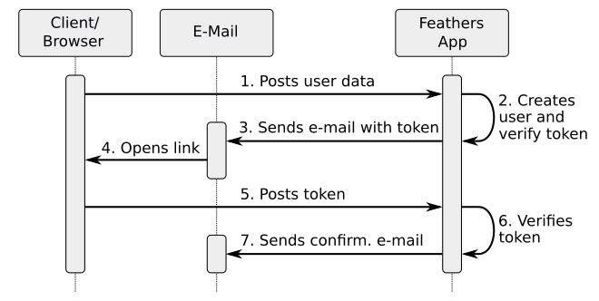
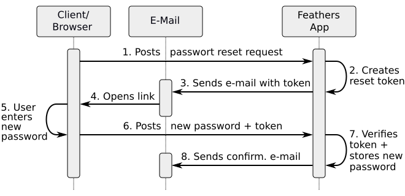

# {{ $frontmatter.title }}

Some of the process flows related to this service are described in this chapter in more detail. They are meant as examples how the service works and what additional implementations are required.

## Sign Up Verification

The sign up verification process is an interplay between the Feathers backend, a client and a communication transport method such as e-mail. Its flow shown in the following figure:

Some of these steps have to be implemented manually on client and server side, others are performed automatically by the `feathers-authentication-management` service.

Sign up verification is performed in an `addVerification` hook in the `create` method of the users service. This hook creates a long and/or short verification token every time a new user is created. It stores these values in the fields `verifyToken`and `verifyShortToken` of the created user item. The expiration date of these tokens is calculated and stored in field `verifyExpires`. The service does not automatically send a notification to the new user, a call of the notifier function has to be implemented in the after hook of the users `create` method. See [Configuration/Service Hooks](./configuration#service-hooks) for more details.

The verification e-mail contains an URL with the long token as a parameter, or – in case of an SMS – it could also just contain the value of the short token. The details depend on your requirements. Also, the implementation of the URL target is up to you. For example, the URL could be a direct call of your Feathers API and trigger the verification. But in general you would like to give the users some feedback. In that case, the URL will lead to your client, the client will send the token to the Feathers API and informs your user about the response. The API could also trigger an additional notification about the success of the verification process (step 7 in the figure).

## Password Resets

A change or reset of a password is more secure, if the user is verified, e. g. by asking the user for a verification by e-mail. The following figure shows such as process flow:

The client sends a [sendResetPwd](./service-calls#sendresetpwd) service call to the `feathers-authentication-management` service. The service creates a short and/or long password reset token, stores it to the user item, and triggers the notifier function to send the token to the user.

The user opens the URL containing the reset token in the e-mail. This URL leads to th client, where the user is asked for a new password. The client sends the new password together with the token to the Feathers API. The API could also trigger another notification about the success of the password change (step 8 in the figure).
